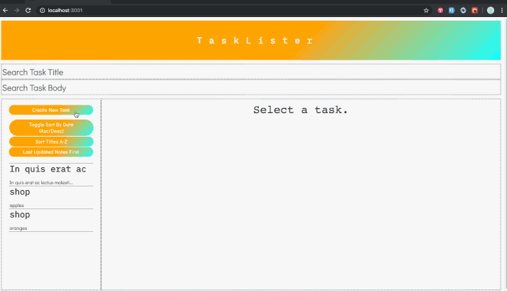

Tasklister
======================

A Tasklisting / To-do List app built using a Rails API backend and React frontend. 

Features:
- Users can create, edit and delete tasks. 
- Users can sort tasks alphabetically, by date created and last updated.
- Users can filter tasks by either title or body of tasks



## Getting Started

Fork and clone this repository.

#### In the backend directory 

Setup the rails database and load the seed data:

```rails db:create```

```rails db:migrate```

```rails db:seed```

Start the rails server.

```rails s```


#### In the frontend directory 
you can run: ```npm install``` to bundle and then ```npm start``` to run the app in the development mode.


